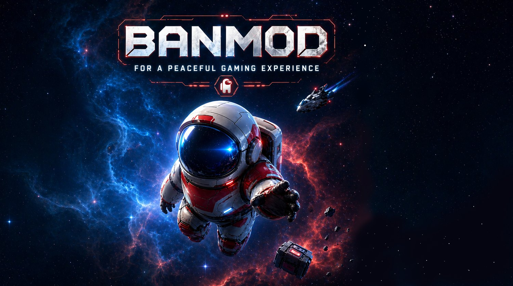
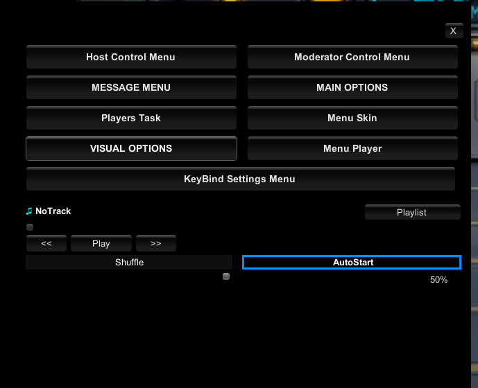
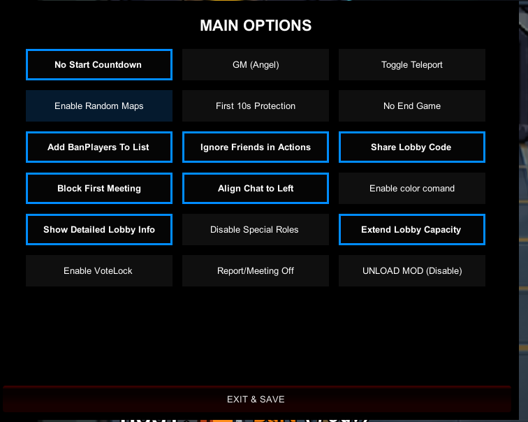
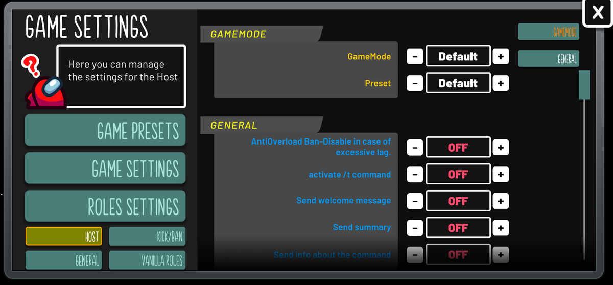
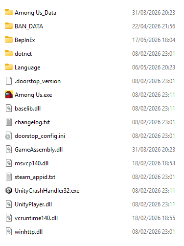

<div align="center">



# BanMod

**Lobby moderation, anti-abuse tools, host controls, custom roles, and configurable game modes for Among Us.**

[](LICENSE)
[](#requirements)
[](https://banmod.online)

**English** · [Italiano](README_IT.md)

[Website](https://banmod.online) · [Downloads](https://banmod.online/downloads) · [Instructions](https://banmod.online/instructions) · [Release notes](https://banmod.online/releases) · [Report an issue](https://github.com/GiannBart/BanMod/issues)

</div>

> [!IMPORTANT]
> BanMod is an unofficial, fan-made modification. Use it only in fair, consensual, or clearly modded lobbies. Host and testing tools must never be used to deceive players, disrupt public games, or gain an unfair advantage.

## About

BanMod is a Windows mod for **Among Us** built with **BepInEx IL2CPP**. Its GPL-licensed core focuses on persistent moderation, anti-abuse protections, host administration, configurable gameplay, custom roles, and quality-of-life interfaces.

The public source repository contains the **core mod only**. Some additional features—historically called “Premium” even though they are currently free of charge—are optional components delivered separately by official BanMod servers after eligibility, compatibility, and security checks. They are not required for the core mod to run and are not included in this repository.

## Highlights

- **Lobby moderation:** persistent ban and block tools, cheater/suspicion lists, forbidden-name and forbidden-word controls, spam protection, AFK handling, and player-management menus.
- **Host controls:** autostart, meeting and voting rules, task and sabotage controls, door behavior, map options, lobby messages, summaries, and configurable player actions.
- **Roles and game modes:** custom or modified roles, role configuration, Hide and Seek improvements, testing modes, and additional gameplay presets.
- **Client and visual tools:** configurable hotkeys, zoom in supported states, lobby decorations, dark theme, custom interfaces, outfit/skin menus, and local quality-of-life options.
- **Private-lobby testing utilities:** selected host/debug tools intended only for controlled testing or games where every participant understands and accepts the rules.
- **Connected services:** optional online verification, reports, server messages, lobby services, anti-abuse systems, and separately delivered optional features.

Features can change between releases. The official website and release notes are the source of truth for the currently supported build.

## Screenshots

<p align="center">
  
  
</p>

<p align="center">
  
</p>

> BanMod branding, custom artwork, screenshots, skins, and visual assets are not licensed under the GPL unless a file explicitly says otherwise. See [Licensing overview](LICENSES.md).

## Requirements

- A legitimate Windows PC copy of **Among Us**.
- The game version supported by the current BanMod release.
- The correct package for **Steam** or **Epic Games**.
- Permission to extract files into the folder containing `Among Us.exe`.

Game updates may break mods. Always check the [official download page](https://banmod.online/downloads) before installing or reporting a problem.

## Installation

1. Download the current package from the [official BanMod download page](https://banmod.online/downloads).
2. Select the package for Steam or Epic Games.
3. Locate the main game folder—the folder that contains `Among Us.exe`.
4. Extract every file from the BanMod ZIP into that folder.
5. Confirm that `Among Us.exe` and the `BepInEx` folder are at the same directory level.
6. Start Among Us. BanMod should appear in the main menu after BepInEx finishes loading.

### Finding the game folder

**Steam:** Library → right-click **Among Us** → **Manage** → **Browse local files**.

**Epic Games:** Library → three-dot menu beside **Among Us** → **Manage** → folder icon.

<p align="center">
  
</p>

### Updating

Back up your `BAN_DATA` folder when a release note recommends it. Remove obsolete or duplicate BanMod DLL files from `BepInEx/plugins`, then install the new official package. Do not mix files from different releases.

### Uninstalling

Use the platform's file verification function:

- **Steam:** Properties → Installed Files → Verify integrity of game files.
- **Epic Games:** Manage → Verify.

Back up personal BanMod presets or configuration files before verification if you want to keep them.

## Default controls

- `Delete`: opens the main BanMod menu.
- `F10`: opens the hotkey configuration menu.

Controls and available menus may differ by release or host permissions. Consult the in-game help and the [official instructions](https://banmod.online/instructions).

## Official services and optional features

The GPL-licensed core and the BanMod-operated online services are separate layers:

- The core source code can be studied, modified, and redistributed under GPLv3.
- Official APIs, verification systems, tokens, report services, lobby services, and server messages are operated by the BanMod project and are subject to their own service rules and privacy terms.
- Optional remote features are **not present in this repository**. They may be downloaded at runtime only after the official server confirms that the relevant requirements are satisfied.
- Optional remote features are separately licensed proprietary components. No permission is granted by this repository to copy, republish, redistribute, sublicense, extract into another project, or include them in a fork.
- These optional features are currently offered without payment, but availability is not guaranteed and access can be changed, suspended, or withdrawn.
- A modified or self-built client is not an official BanMod release and is not eligible for optional official features by default.

Service rules do not remove the rights granted by GPLv3 over GPL-covered source code. Conversely, GPLv3 does not grant a right to use privately operated servers, credentials, branding, or separately licensed components.

## Fair-play and service rules

When using an official build or BanMod-operated services:

1. Do not use cheat menus, malicious clients, exploits, unlockers, request manipulation, API abuse, spam, false reports, bypass tools, or other systems intended to harm the game, the project, or other players.
2. Other legitimate mods are not automatically prohibited, but compatibility or security checks may restrict connected features. Contact the administrator before development tests or unusual multi-mod setups.
3. Do not send automated, malformed, excessive, or unauthorized requests to official BanMod endpoints.
4. Do not reuse official tokens, credentials, build identifiers, or private endpoint details in forks.
5. Technical restrictions may be applied to abusive or incompatible clients, tokens, mod IDs, friend codes, player IDs, accounts, IP addresses, or other service identifiers.
6. User reports are review signals and should not be treated as proof without reasonable checks.
7. Respect the Among Us Terms of Use, Mod Policy, community rules, local law, and the consent of other players.

Read the current **Important Rules** and **Privacy Policy** on the [official policies page](https://banmod.online/policies) before enabling connected features.

## Forks and modified builds

Forking and modifying the GPL-covered code is permitted. A compliant public fork should:

- keep the GPLv3 license, copyright notices, attribution, and warranty disclaimer;
- state prominently that the project was modified and include the relevant modification date;
- provide complete corresponding source for every distributed binary;
- license GPL-covered derivative code under GPLv3 and avoid additional restrictions on GPL rights;
- identify the build as unofficial and avoid implying endorsement by GianniBart, BanMod, Among Us, or Innersloth;
- remove or replace BanMod logos, custom skins, artwork, screenshots, and other proprietary assets unless written permission has been granted;
- disable or replace official BanMod API integrations instead of using official infrastructure without authorization;
- never include private server modules, optional remote components, secret keys, tokens, personal data, reports, or game files;
- provide support for the fork independently and avoid directing fork-specific problems to the official BanMod support channels.

A fork may remain fully GPL-compliant while using its own backend or no backend at all. Official-service eligibility is a separate operational decision, not a restriction on the right to modify the code.

## Building from source

The project targets **.NET 6** and uses BepInEx IL2CPP packages.

```bash
git clone https://github.com/GiannBart/BanMod.git
cd BanMod
dotnet restore
dotnet build -c Release
```

Before building, review `BanMod.csproj`:

- replace or remove developer-specific absolute Windows paths;
- update the IL2CPP game assembly and metadata paths for your own legitimate installation;
- adjust or remove the local post-build copy target;
- never commit `BanMod.BuildCode.txt`, generated secret source, API credentials, or local configuration;
- do not commit or redistribute Among Us binaries, `Among Us_Data`, `GameAssembly.dll`, or other game files.

The compiled DLL is normally produced under `bin/Release/net6.0/`. Self-built binaries are unofficial and may not connect to official BanMod services.

## Releases and changes

- Public changes are summarized in [CHANGELOG.md](CHANGELOG.md).
- Official release notes and compatibility notices are published at [banmod.online/releases](https://banmod.online/releases).
- Repository or project-file version numbers may represent development work and may be newer than the latest public release. Only an explicitly published official package should be treated as a release.

## Contributing

Issues and pull requests for the GPL-covered core are welcome when they are lawful, respectful, and compatible with the project goals.

By submitting code to this repository, you confirm that you have the right to contribute it and that it can be distributed under GPLv3 unless a separate written agreement says otherwise. Do not submit proprietary optional modules, BanMod private assets, leaked game code, secret endpoints, credentials, personal data, or copied code without a compatible license and preserved attribution.

For security issues, follow [SECURITY.md](SECURITY.md) instead of opening a public issue.

## Credits

BanMod includes original work and work inspired by or derived from open-source community projects. Preserve all notices in the source files and in `Resources/Credits and License.txt`.

Major credited projects include:

- [Town of Host](https://github.com/tukasa0001/TownOfHost)
- [Town of Host Enhanced](https://github.com/EnhancedNetwork/TownofHost-Enhanced)
- [EndlessHostRoles](https://github.com/Gurge44/EndlessHostRoles)
- [AmongUsRevamped](https://github.com/ApeMV/AmongUsRevamped)
- [MalumMenu](https://github.com/scp222thj/MalumMenu)
- [TheOtherRoles](https://github.com/TheOtherRolesAU/TheOtherRoles) / TheOtherHats
- [BetterAmongUs](https://github.com/D1GQ/BetterAmongUs-Public)
- NLayer components and contributors, under the MIT License where indicated

Credits are not claims of affiliation or endorsement.

## Licensing overview

- **Core source code:** GNU General Public License v3.0, except where a file contains a different compatible notice.
- **Third-party code:** remains subject to its original notices and license obligations.
- **Optional server-delivered components:** proprietary/private license; not included in this repository and not covered by the repository's GPL grant.
- **Custom skins, logos, branding, artwork, screenshots, and media:** © 2026 GianniBart. All rights reserved, unless explicitly stated otherwise.
- **Among Us intellectual property:** belongs to Innersloth LLC and/or its licensors.

See [LICENSE](LICENSE) for GPLv3 and [LICENSES.md](LICENSES.md) for the component-by-component scope. The summary above is informational and does not replace the actual license texts.

## Non-affiliation and legal disclaimer

BanMod is an unofficial fan-made modification for Among Us. It is not affiliated with, endorsed by, sponsored by, or otherwise approved by Innersloth LLC. Among Us, its names, logos, characters, and related materials are owned by Innersloth LLC or their respective rights holders.

The mod must retain the in-game mod identification stamp required by the [Among Us Mod Policy](https://www.innersloth.com/among-us-mod-policy/). BanMod releases must not include the Among Us base game or unauthorized copies of game assets.

The software is provided **as is**, without warranty. To the extent allowed by applicable law, the authors are not responsible for bans, account restrictions, data loss, incompatibility, crashes, service interruption, or damage arising from misuse, unsupported configurations, modified builds, or violations of third-party rules.

## Support

- Website: [banmod.online](https://banmod.online)
- Email: `banmod.giannibart@gmail.com`
- Discord and other current contact methods: use the links shown on the [official contact page](https://banmod.online/contacts)
- Bugs in the public GPL core: [GitHub Issues](https://github.com/GiannBart/BanMod/issues)

When reporting a problem, include the BanMod version, Among Us version, platform, steps to reproduce, and sanitized logs. Never post tokens, friend codes, player identifiers, email addresses, private messages, or other personal data publicly.
