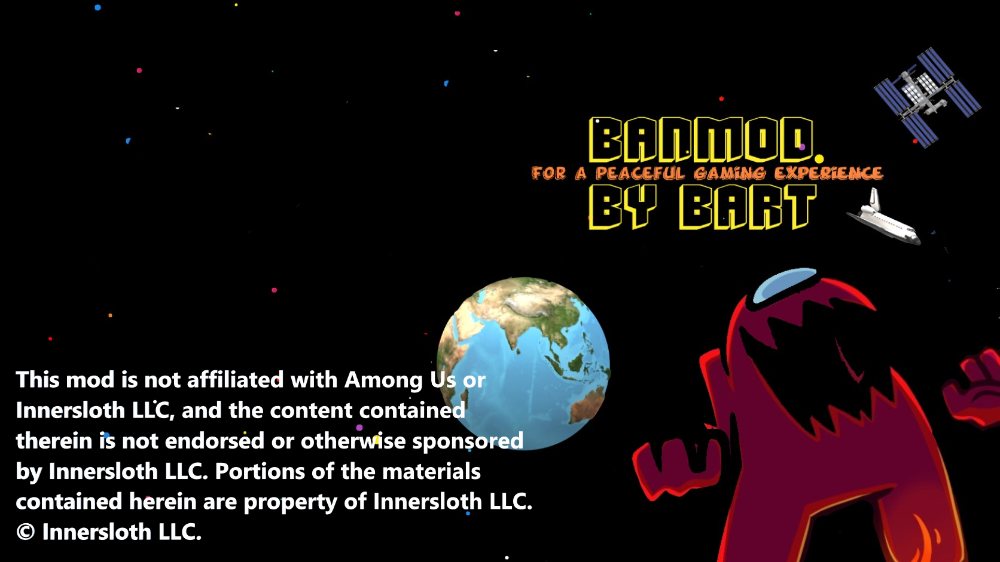

> [!WARNING]
> ## Prima di usare BanMod: scegli la modalità corretta
>
> BanMod offre due modalità. La scelta dipende dalle funzioni che verranno usate nella lobby:
>
> - **Modded +25:** per ospitare lobby con modifiche al gameplay, ruoli personalizzati, funzioni host che cambiano il comportamento del gioco o qualsiasi modifica che possa influire sull’esperienza degli altri giocatori. La lobby deve essere identificata e registrata come moddata secondo la [Among Us Mod Policy](https://www.innersloth.com/among-us-mod-policy/) e la [documentazione tecnica ufficiale](https://github.com/Innersloth-LLC/AmongUsModdingInformation).
> - **Vanilla:** per usare esclusivamente l’anti-cheat e modifiche visive locali che non cambiano il gameplay né l’esperienza degli altri giocatori. “Vanilla” è il nome della modalità BanMod e non significa che il client non sia modificato. Innersloth precisa che non è possibile classificare in anticipo ogni caso relativo agli anti-cheat e raccomanda di registrare la mod in caso di dubbio.
>
> Nella modalità **Modded +25** i comandi restano invariati. Per nascondere agli altri giocatori il testo del comando, sostituisci il prefisso `/` con `/cmd`: ad esempio, `/bm blu` diventa `/cmd bm blu`.
>
> Seleziona sempre la modalità adatta alle funzioni attive. Non usare BanMod per disturbare altri giocatori, alterare lobby non consenzienti, ingannare i partecipanti o ottenere vantaggi sleali.

> [!CAUTION]
> ## BanMod è contro i cheat
>
> Se BanMod rileva altre mod o componenti non riconosciuti, si disattiva automaticamente e blocca le funzionalità Premium. Questo controllo serve a proteggere il progetto, i servizi e gli utenti da cheat, manomissioni e configurazioni incompatibili.
>
> Se utilizzi un’altra mod lecita, contatta l’amministratore prima di usarla insieme a BanMod: verrà valutata e, se ritenuta compatibile e legittima, potrà essere inserita nella whitelist. La presenza di una mod non riconosciuta non dà diritto all’accesso ai servizi o alle funzioni opzionali.

---

<div align="center">



# BanMod

**Moderazione delle lobby, protezione anti-abuso, controlli host, ruoli personalizzati e modalità configurabili per Among Us.**

[](LICENSE)
[](#requisiti)
[](https://banmod.online)

[Sito](https://banmod.online) · [Istruzioni](https://banmod.online/instructions) · [Download](https://banmod.online/downloads)

</div>

> [!IMPORTANT]
> BanMod è una modifica non ufficiale creata dalla community. Prima di scaricarla o utilizzare i servizi ufficiali, leggi le [informazioni e regole importanti](IMPORTANT_INFO_AND_RULES.md), le [regole ufficiali](https://banmod.online/rules), la [Privacy Policy](https://banmod.online/policy/privacy), la [Cookie Policy](https://banmod.online/policy/cookies) e, soprattutto, la [Among Us Mod Policy sul sito ufficiale di Innersloth](https://www.innersloth.com/among-us-mod-policy/). La policy può cambiare: è responsabilità dell’utente consultare sempre la versione aggiornata.

## Descrizione

BanMod è una mod per **Among Us su Windows**, basata su **BepInEx IL2CPP**. Il core pubblico, distribuito con licenza GPLv3, comprende strumenti di moderazione persistente, protezioni anti-abuso, amministrazione host, opzioni di gioco, ruoli personalizzati e interfacce di supporto.

Il repository pubblico contiene esclusivamente il **core**. Alcune funzioni aggiuntive, storicamente chiamate “Premium”, sono componenti opzionali separati e non sono necessarie per compilare o usare il core.

## Funzioni principali

- **Moderazione:** ban e blocchi persistenti, liste di giocatori sospetti, filtri per nomi e parole, protezione dallo spam, gestione AFK e amministrazione dei giocatori.
- **Controlli host:** avvio automatico, regole per riunioni e votazioni, task, sabotaggi, porte, mappe, messaggi lobby, riepiloghi e azioni configurabili.
- **Ruoli e modalità:** ruoli personalizzati o modificati, preset, configurazione dei ruoli, miglioramenti per Hide and Seek e modalità di test.
- **Strumenti client e visivi:** tasti configurabili, zoom negli stati consentiti, decorazioni, tema scuro, interfacce personalizzate, menu outfit/skin e opzioni locali.
- **Anti-cheat e servizi connessi:** verifiche opzionali, segnalazioni, messaggi server, sistemi anti-abuso e servizi lobby.

Gli strumenti host, di debug o di test devono essere usati soltanto in ambienti controllati o in lobby nelle quali tutti i partecipanti conoscano e accettino le regole.

## Immagini

<p align="center">
  
  
</p>

<p align="center">
  
</p>

Le skin personalizzate BanMod sono contenuti proprietari separati: non fanno parte del codice sorgente pubblico e non sono distribuite con licenza GPL. Vedi [Licenze](#licenze-e-componenti).

## Requisiti

- Una copia legittima di **Among Us** per Windows PC.
- Una versione del gioco supportata dalla release BanMod corrente.
- Il pacchetto corretto per **Steam** o **Epic Games**.
- Il permesso di estrarre file nella cartella che contiene `Among Us.exe`.

Gli aggiornamenti di Among Us possono interrompere la compatibilità. Controlla sempre la release più recente prima di installare BanMod o segnalare un problema.

## Installazione

1. Scarica il pacchetto corrente dalla [pagina ufficiale](https://banmod.online/downloads).
2. Seleziona la versione Steam o Epic Games.
3. Apri la cartella che contiene `Among Us.exe`.
4. Estrai nella cartella tutti i file dello ZIP BanMod.
5. Verifica che `Among Us.exe` e la cartella `BepInEx` siano allo stesso livello.
6. Avvia Among Us: dopo il caricamento di BepInEx, BanMod dovrebbe comparire nel menu principale.

**Steam:** Libreria → clic destro su **Among Us** → **Gestisci** → **Sfoglia file locali**.

**Epic Games:** Libreria → menu con tre punti accanto a **Among Us** → **Gestisci** → icona della cartella.

### Aggiornamento e disinstallazione

Quando indicato nelle note di rilascio, esegui il backup della cartella `BAN_DATA`. Rimuovi DLL BanMod obsolete o duplicate da `BepInEx/plugins` e non mescolare file di release diverse.

Per disinstallare, salva prima eventuali preset o configurazioni che vuoi conservare, quindi usa la verifica dei file della piattaforma:

- **Steam:** Proprietà → File installati → Verifica integrità dei file di gioco.
- **Epic Games:** Gestisci → Verifica.

## Comandi predefiniti

- `Delete`: apre il menu principale BanMod.
- `F10`: apre il menu di configurazione dei tasti.

I tasti e i menu disponibili possono cambiare in base alla release e ai permessi host. Consulta la guida nel gioco e le [istruzioni ufficiali](https://banmod.online/instructions).

## Funzioni Premium opzionali

Le funzioni Premium sono funzioni aggiuntive, non associate al funzionamento principale del core:

- sono **facoltative**, **gratuite** e non necessarie per usare o compilare la mod pubblica;
- non sono incluse in questo repository e vengono distribuite separatamente tramite i servizi ufficiali;
- devono essere selezionate nel menu di login principale per essere attivate;
- sono offerte esclusivamente agli utenti che rispettano le regole, superano i controlli di sicurezza e usano configurazioni compatibili;
- sono soggette a una licenza privata/proprietaria separata, descritta in [LICENSES.md](LICENSES.md);
- non sono obbligatorie, promesse o dovute e la loro disponibilità può essere modificata, sospesa o revocata;
- non possono essere copiate, estratte, ripubblicate, ridistribuite, sublicenziate o incluse in fork senza un’autorizzazione scritta separata.

I servizi BanMod — incluse API, verifiche, token, segnalazioni, messaggi server e servizi lobby — sono distinti dal core GPL e soggetti alle proprie regole e informative. Le regole dei servizi non limitano i diritti concessi dalla GPLv3 sul codice effettivamente coperto dalla GPL.

## Regole d’uso

Quando usi una build ufficiale o i servizi BanMod:

1. Non usare cheat, client malevoli, exploit, unlocker, manipolazione di richieste, spam, segnalazioni false, bypass o altri strumenti destinati a danneggiare il gioco, il progetto o gli utenti.
2. Non disturbare lobby pubbliche, non modificare l’esperienza di giocatori inconsapevoli e non ottenere vantaggi sleali.
3. Seleziona **Modded +25** quando le funzioni cambiano il gameplay, il comportamento dei ruoli, l’autorità host o l’esperienza di altri giocatori; in caso di dubbio, registra la mod.
4. Usa la modalità **Vanilla** soltanto con anti-cheat e modifiche visive locali che non modificano gameplay o peer.
5. Non inviare richieste automatizzate, malformate, eccessive o non autorizzate agli endpoint BanMod.
6. Non riutilizzare in fork token, credenziali, identificatori di build o dettagli privati degli endpoint ufficiali.
7. Rispetta i Termini d’uso e la Mod Policy di Among Us, le regole della community, la legge applicabile e il consenso degli altri giocatori.

Le segnalazioni degli utenti devono essere verificate e non costituiscono prova senza controlli ragionevoli. Restrizioni tecniche possono essere applicate a client, token o identificatori collegati ad abuso, incompatibilità o violazioni.

## Fork e build modificate

Il codice del core coperto da GPLv3 può essere studiato, modificato e forkato. Chi distribuisce un fork deve, tra l’altro:

- conservare la GPLv3, gli avvisi di copyright, le attribuzioni e le esclusioni di garanzia;
- indicare chiaramente le modifiche apportate e la relativa data;
- fornire il sorgente corrispondente completo per ogni binario distribuito;
- distribuire il codice derivato coperto dalla GPLv3 con la stessa licenza, senza ulteriori restrizioni;
- dichiarare che il fork è non ufficiale e non suggerire approvazione da parte di GianniBart, BanMod, Among Us o Innersloth;
- non includere skin proprietarie BanMod, componenti Premium separati, moduli server privati, chiavi, token, dati personali, segnalazioni o file di gioco;
- sostituire o disattivare le integrazioni con le API ufficiali BanMod, salvo autorizzazione;
- fornire supporto autonomo senza indirizzare i problemi specifici del fork ai canali ufficiali BanMod.

Un fork può usare un backend proprio o nessun backend. Una build modificata o compilata autonomamente non è una release ufficiale e può non essere ammessa ai servizi o alle funzioni opzionali; ciò non elimina i diritti concessi dalla GPLv3 sul core GPL.

Il progetto considera i componenti Premium distribuiti separatamente opere indipendenti e non parte del core GPL pubblicato. Il riferimento è l’ultimo paragrafo della [sezione 5 della GPLv3](https://www.gnu.org/licenses/gpl-3.0.html#section5), relativo agli aggregati. Questo richiamo non trasforma automaticamente un componente in opera indipendente: la qualificazione dipende dalla sua effettiva natura e integrazione tecnica. Nulla in questo README limita i diritti GPL sul codice che ricade realmente sotto tale licenza.

## Compilazione dal sorgente

Il progetto usa **.NET 6** e pacchetti BepInEx IL2CPP:

```bash
git clone https://github.com/GiannBart/BanMod.git
cd BanMod
dotnet restore
dotnet build -c Release
```

Prima della compilazione, controlla `BanMod.csproj`: rimuovi percorsi Windows specifici dello sviluppatore, configura assembly e metadati IL2CPP dalla tua copia legittima del gioco e rimuovi target locali di post-build. Non pubblicare segreti, credenziali, configurazioni locali, binari di Among Us, `Among Us_Data`, `GameAssembly.dll` o altri file del gioco.

La DLL viene normalmente generata in `bin/Release/net6.0/`.

## Contributi e crediti

Issue e pull request per il core GPL sono benvenute se rispettano persone, legge, licenze e obiettivi del progetto. Inviando codice, dichiari di avere il diritto di contribuire e accetti che il contributo sia distribuito sotto GPLv3, salvo diverso accordo scritto. Non inviare componenti proprietari, codice di gioco ottenuto illecitamente, endpoint segreti, credenziali o dati personali.

BanMod contiene lavoro originale e parti ispirate o derivate da progetti open source. Conserva tutti gli avvisi presenti nei file sorgente e in `Resources/Credits and License.txt`.

Progetti principali accreditati:

- [Town of Host](https://github.com/tukasa0001/TownOfHost)
- [Town of Host Enhanced](https://github.com/EnhancedNetwork/TownofHost-Enhanced)
- [EndlessHostRoles](https://github.com/Gurge44/EndlessHostRoles)
- [AmongUsRevamped](https://github.com/ApeMV/AmongUsRevamped)
- [MalumMenu](https://github.com/scp222thj/MalumMenu)
- [TheOtherRoles](https://github.com/TheOtherRolesAU/TheOtherRoles) / TheOtherHats
- [BetterAmongUs](https://github.com/D1GQ/BetterAmongUs-Public)
- [GameLogger](https://github.com/whichtwix/GameLogger)
- componenti e contributori NLayer, sotto licenza MIT dove indicato

I crediti non implicano affiliazione o approvazione.

## Licenze e componenti

| Componente | Licenza o titolarità | Riferimento |
| --- | --- | --- |
| Core e sorgente pubblico BanMod | GNU General Public License v3.0, salvo file con un diverso avviso compatibile | [LICENSE](LICENSE) · [GPLv3 §5](https://www.gnu.org/licenses/gpl-3.0.html#section5) |
| Codice e librerie di terze parti | Licenze e avvisi originali, inclusa MIT dove indicato | [LICENSES.md](LICENSES.md) · `Resources/Credits and License.txt` |
| Componenti Premium opzionali distribuiti dal server | Licenza privata/proprietaria separata; non inclusi nel repository | [LICENSES.md](LICENSES.md) |
| Skin personalizzate BanMod | © 2026 GianniBart. Tutti i diritti riservati; contenuti separati dal core | [LICENSES.md](LICENSES.md) |
| Among Us, nomi, loghi, personaggi e materiali correlati | Proprietà di Innersloth LLC e/o dei rispettivi licenzianti | [Among Us Mod Policy](https://www.innersloth.com/among-us-mod-policy/) |

Questa tabella è solo un riepilogo e non sostituisce i testi di licenza applicabili. La distinzione tra core GPL e componenti separati dipende anche dalla struttura e dall’integrazione effettiva del software; per decisioni legali è opportuno consultare un professionista qualificato.

## Avviso Innersloth, non affiliazione e responsabilità

BanMod deve mostrare durante il gameplay il mod stamp richiesto dalla [Among Us Mod Policy](https://www.innersloth.com/among-us-mod-policy/) e non deve includere il gioco base o copie non autorizzate dei file di Among Us.

Testo ufficiale richiesto da Innersloth, riportato senza modifiche:

> This mod is not affiliated with Among Us or Innersloth LLC, and the content contained therein is not endorsed or otherwise sponsored by Innersloth LLC. Portions of the materials contained herein are property of Innersloth LLC. © Innersloth LLC.

Il software è fornito **“così com’è”**, senza garanzie espresse o implicite. Nella misura massima consentita dalla legge, autori e collaboratori non rispondono di ban, restrizioni dell’account, perdita di dati, incompatibilità, crash, interruzioni dei servizi o danni derivanti dall’uso o abuso della mod, da configurazioni non supportate, da build modificate o dalla violazione di regole di terzi.

L’uso della mod è a rischio dell’utente. Né questo README né il selettore di modalità garantiscono che una specifica configurazione sia conforme a ogni futura versione delle regole di Innersloth: consulta la [policy ufficiale aggiornata](https://www.innersloth.com/among-us-mod-policy/) e la [documentazione tecnica ufficiale](https://github.com/Innersloth-LLC/AmongUsModdingInformation) prima dell’uso.

## Supporto

- Sito: [banmod.online](https://banmod.online)
- Email: `banmod.giannibart@gmail.com`
- Bug del core GPL pubblico: [GitHub Issues](https://github.com/GiannBart/BanMod/issues)

In una segnalazione indica versione BanMod, versione Among Us, piattaforma, passaggi per riprodurre il problema e log privi di dati sensibili. Non pubblicare token, friend code, identificatori giocatore, email, messaggi privati o altri dati personali.
